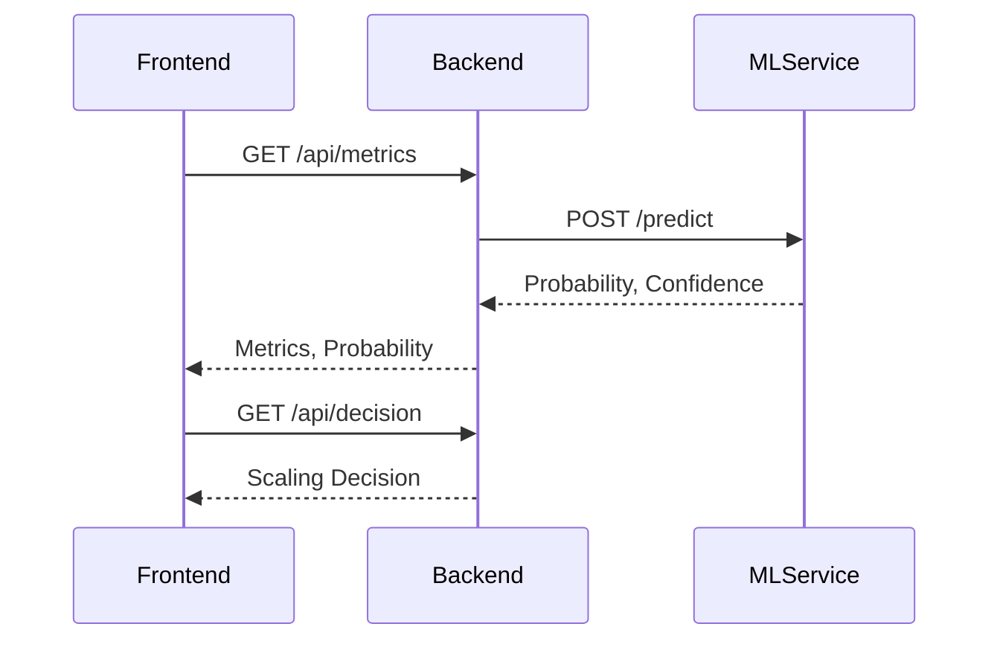

# CloudOpt: AI-Based Cloud Resource Optimization
**Full Project Documentation (Detailed Edition)**

---

## 1. Project Overview
CloudOpt is an end-to-end, AI-driven cloud telemetry and resource optimization system. It actively monitors simulated cloud infrastructure, predicts the probability of resource failures using a machine learning pipeline, and suggests autonomous scaling decisions (Scale Up / Scale Down / Stable).

The application is structured into a microservices-inspired architecture comprising three main pillars:
1. **Machine Learning Service (Python / FastAPI)**
2. **Backend API (Java / Spring Boot)**
3. **Frontend Dashboard (React.js)**

---

## 2. Architecture & Tech Stack

### 2.1 Machine Learning Service (`/ml-service`)
- **Language**: Python 3
- **Core Libraries**: `scikit-learn`, `LightGBM`, `pandas`, `FastAPI` (exposed on port `8000`)
- **Role**: Predictive engine. Consumes telemetry metrics (CPU usage distributions, lag features, memory allocation) and runs inference using a trained LightGBM binary classifier to output a failure probability.

### 2.2 Backend Application (`/backend`)
- **Framework**: Spring Boot 3.2.5 (Java 17)
- **Core Libraries**: `spring-boot-starter-web`, `httpclient`
- **Role**: Central orchestrator and business logic layer. Simulates/collects machine telemetry and interfaces with the Python ML service via HTTP to request failure predictions.

### 2.3 Frontend Dashboard (`/frontend`)
- **Framework**: React 18
- **Core Libraries**: `recharts` (for data visualization), `ajv`
- **Role**: Modern UI for SREs. Continuously polls the backend API (every 6 seconds) to generate real-time visualizations of system stability.

---

## 3. API Specifications

### 3.1 Backend API Endpoints (Spring Boot)

#### `GET /api/metrics`
- **Description**: Retrieves the latest machine metrics and the AI's predicted failure probability.
- **Response Example:**
```json
{
  "cpu_dist": [0.12, 0.15, ...],
  "cpu_mean": 0.14,
  "cpu_std": 0.03,
  "cpu_lag1": 0.13,
  "cpu_lag2": 0.12,
  "failure_probability": 0.08,
  "confidence": "low"
}
```

#### `GET /api/decision`
- **Description**: Computes the business action (e.g., `SCALE_UP`, `SCALE_DOWN`, `STABLE`) based on the predicted CPU state and failure thresholds.
- **Response Example:**
```json
{
  "decision": "STABLE",
  "probability": 0.08,
  "cooldown": false
}
```

#### `POST /api/predict`
- **Description**: Manually triggers the prediction workflow.
- **Request Example:**
```json
{
  "cpu_dist": [0.12, 0.15, ...],
  "cpu_mean": 0.14,
  "cpu_std": 0.03,
  "cpu_lag1": 0.13,
  "cpu_lag2": 0.12
}
```
- **Response Example:**
```json
{
  "failure_probability": 0.08,
  "confidence": "low"
}
```

### 3.2 ML Service API Endpoints (FastAPI)

#### `POST /predict`
- **Description**: Receives a 31-feature telemetry vector and returns failure probability and confidence.
- **Request Example:**
```json
{
  "cpu_dist_p10": 0.10,
  "cpu_dist_p50": 0.14,
  ...
  "cpu_lag2": 0.12
}
```
- **Response Example:**
```json
{
  "probability": 0.08,
  "confidence": "low"
}
```

#### `GET /health`
- **Description**: Health check endpoint for service liveness.
- **Response Example:**
```json
{
  "status": "ok"
}
```

---

## 4. Sequence Diagrams

### 4.1 System Workflow



---

## 5. Machine Learning Pipeline Details

### 5.1 Feature Engineering
- Extracted distribution percentiles (e.g., `cpu_dist_p95`)
- Computed rolling means (window=5)
- Historical lag features (`cpu_lag1`, `cpu_lag2`)

### 5.2 Model Training
- **Model**: LightGBM binary classifier
- **Class Imbalance**: 77/23, handled via class weights
- **Evaluation**: 99.6% Accuracy, 0.9998 ROC-AUC, F1-Score 0.99 (minority class)

### 5.3 Inference & Deployment
- FastAPI loads `failure_model.pkl` and `scaler.pkl` at startup (RAM-resident)
- Sub-millisecond inference latency
- `/predict` endpoint standardizes input, runs inference, returns probability and confidence

---

## 6. Backend Simulation & Logic

### 6.1 Load Simulation
- **Bimodal State Machine**: Alternates between HEALTHY (0.05-0.18) and STRESSED (0.82-0.94) states
- **Gaussian Distribution**: Generates 11-bin CPU histogram using Gaussian algorithm

### 6.2 Fallback Heuristics
- If ML service is offline, uses sigmoid fallback: `1.0 / (1.0 + Math.exp(-16.0 * (load - 0.50)))`

### 6.3 Scaling Decision Engine
- Thresholds: SCALE_UP > 0.70, SCALE_DOWN < 0.30
- 30-second cooldown to prevent thrashing

---

## 7. Frontend UI/UX & Component Design

### 7.1 Decision Banner
- Prominent, animated banner with color transitions:
  - STABLE: Green gradients, soft glow
  - SCALE_UP: Red accents, alert animation
  - SCALE_DOWN: Blue gradients, calm effect

### 7.2 Real-time Charting
- Area charts (Recharts) for last 30 points of CPU and Failure Probability
- Linear gradients, custom tooltips, smooth transitions

### 7.3 Risk Gauge
- Custom SVG half-circle gauge
- Animates from green to red based on probability

### 7.4 Diagnostics & Service Health
- Visual status dots for backend and ML service health
- Parallel polling of `/api/metrics`, `/api/decision`, and ML `/health`

---

## 8. Deployment & Environment Setup

### 8.1 Prerequisites
- Python 3.8+, Java 17, Node.js 18+
- Install dependencies:
  - ML Service: `pip install -r requirements.txt`
  - Backend: `mvn clean install`
  - Frontend: `npm install`

### 8.2 Running Services
- ML Service: `uvicorn main:app --host 0.0.0.0 --port 8000`
- Backend: `mvn spring-boot:run`
- Frontend: `npm start`

### 8.3 Environment Variables
- Backend: Configure `application.yml` for ML service URL if needed
- ML Service: Place `failure_model.pkl` and `scaler.pkl` in working directory

---

## 9. Testing & Troubleshooting

### 9.1 Testing
- Backend: `mvn test`
- ML Service: `pytest`
- Frontend: `npm test`

### 9.2 Troubleshooting
- **ML Service not responding**: Check FastAPI logs, ensure model files are present
- **Backend fallback triggered**: ML service may be offline, see logs for fallback activation
- **Frontend not updating**: Check browser console for CORS or network errors

---

## 10. Extensibility & Future Work

- Add authentication and RBAC for API endpoints
- Support for multi-node telemetry aggregation
- Integrate advanced anomaly detection models
- Expand dashboard with historical analytics and alerting

---
